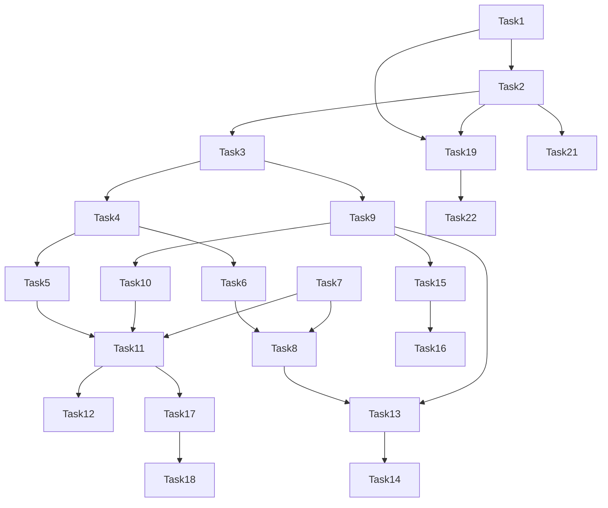

# Tasks

## Phase 1: 项目基础架构

- [x] Task 1: 创建Godot 4.x项目基础结构
  - [x] SubTask 1.1: 初始化Godot 4.x项目，配置项目设置（窗口大小、渲染等）
  - [x] SubTask 1.2: 创建标准目录结构（scenes/scripts/assets/resources/autoload）
  - [x] SubTask 1.3: 配置Git版本控制，创建.gitignore

- [x] Task 2: 实现全局管理器系统
  - [x] SubTask 2.1: 创建GameManager（游戏状态管理、场景切换）
  - [x] SubTask 2.2: 创建SaveManager（存档/读档功能）
  - [x] SubTask 2.3: 创建AudioManager（背景音乐、音效管理）
  - [x] SubTask 2.4: 创建UIManager（UI层级管理、弹窗系统）
  - [x] SubTask 2.5: 配置Autoload自动加载

- [x] Task 3: 创建数据资源定义
  - [x] SubTask 3.1: 创建ItemData资源（物品基础数据结构）
  - [x] SubTask 3.2: 创建WeaponData资源（武器数据结构）
  - [x] SubTask 3.3: 创建EnemyData资源（敌人数据结构）
  - [x] SubTask 3.4: 创建PerkData资源（技能数据结构）

## Phase 2: 角色系统

- [x] Task 4: 实现玩家角色控制器
  - [x] SubTask 4.1: 创建Player场景，实现俯视角八方向移动
  - [x] SubTask 4.2: 实现角色朝向控制（鼠标/摇杆指向）
  - [x] SubTask 4.3: 实现角色动画系统（待机/移动/攻击/受伤）
  - [x] SubTask 4.4: 实现角色属性系统（生命值、移动速度、负重等）

- [x] Task 5: 实现视野系统
  - [x] SubTask 5.1: 创建扇形视野组件（Light2D或自定义Shader）
  - [x] SubTask 5.2: 实现战争迷雾效果
  - [x] SubTask 5.3: 实现掩体遮挡视野逻辑

## Phase 3: 战斗系统

- [x] Task 6: 实现武器系统
  - [x] SubTask 6.1: 创建Weapon基类（近战/远程）
  - [x] SubTask 6.2: 实现近战武器攻击（挥砍、范围检测）
  - [x] SubTask 6.3: 实现远程武器射击（子弹、弹道）
  - [x] SubTask 6.4: 实现弹药系统（弹药类型、数量管理）

- [x] Task 7: 实现敌人AI系统
  - [x] SubTask 7.1: 创建Enemy基类（属性、状态机）
  - [x] SubTask 7.2: 实现敌人巡逻行为
  - [x] SubTask 7.3: 实现敌人追击行为
  - [x] SubTask 7.4: 实现敌人攻击行为（近战预警动画）
  - [x] SubTask 7.5: 实现敌人警戒系统（视野检测、听觉检测）

- [x] Task 8: 实现伤害与死亡系统
  - [x] SubTask 8.1: 创建HealthComponent（生命值管理）
  - [x] SubTask 8.2: 实现伤害计算（武器伤害、护甲减伤）
  - [x] SubTask 8.3: 实现死亡处理（玩家死亡、敌人死亡）
  - [x] SubTask 8.4: 实现受伤反馈（闪烁、音效）

## Phase 4: 物资与背包系统

- [x] Task 9: 实现背包系统
  - [x] SubTask 9.1: 创建Inventory组件（物品存储、数量管理）
  - [x] SubTask 9.2: 实现背包UI（物品列表、拖拽排序）
  - [x] SubTask 9.3: 实现物品拾取与丢弃
  - [x] SubTask 9.4: 实现负重系统（重量计算、超重惩罚）

- [x] Task 10: 实现物资搜刮系统
  - [x] SubTask 10.1: 创建LootContainer场景（可搜刮容器）
  - [x] SubTask 10.2: 实现随机物资生成（基于概率表）
  - [x] SubTask 10.3: 实现搜刮交互UI
  - [x] SubTask 10.4: 实现地面物资拾取

## Phase 5: 地图与撤离系统

- [x] Task 11: 创建战区地图
  - [x] SubTask 11.1: 设计并创建第一张战区地图（TileMap）
  - [x] SubTask 11.2: 放置物资刷新点
  - [x] SubTask 11.3: 放置敌人刷新点
  - [x] SubTask 11.4: 放置撤离点（绿色烟雾标记）

- [x] Task 12: 实现撤离系统
  - [x] SubTask 12.1: 创建ExtractionPoint场景
  - [x] SubTask 12.2: 实现撤离检测（玩家进入区域）
  - [x] SubTask 12.3: 实现撤离成功处理（返回基地、保留物品）
  - [x] SubTask 12.4: 实现撤离UI（倒计时、确认提示）

## Phase 6: 死亡与回收系统

- [x] Task 13: 实现死亡惩罚系统
  - [x] SubTask 13.1: 创建玩家死亡处理流程
  - [x] SubTask 13.2: 实现死亡时物品掉落（生成尸体容器）
  - [x] SubTask 13.3: 实现尸体位置记录（存档）
  - [x] SubTask 13.4: 实现尸体回收功能（找回物品）

- [x] Task 14: 实现安全槽系统
  - [x] SubTask 14.1: 创建安全槽UI（宠物槽/锁定槽）
  - [x] SubTask 14.2: 实现安全槽物品保护（死亡不丢失）
  - [x] SubTask 14.3: 实现安全槽不计入负重

## Phase 7: 基地系统

- [x] Task 15: 创建基地场景
  - [x] SubTask 15.1: 设计并创建基地地图
  - [x] SubTask 15.2: 创建储物柜设施（物品存储）
  - [x] SubTask 15.3: 创建工作台设施（基础制造）
  - [x] SubTask 15.4: 实现基地与战区的场景切换

- [x] Task 16: 实现制造系统
  - [x] SubTask 16.1: 创建制造配方数据结构
  - [x] SubTask 16.2: 实现制造UI（配方选择、材料显示）
  - [x] SubTask 16.3: 实现制造逻辑（消耗材料、生成物品）
  - [x] SubTask 16.4: 实现物品拆解功能

## Phase 8: 风险-收益系统

- [x] Task 17: 实现时间奖励系统
  - [x] SubTask 17.1: 创建战区停留时间计时器
  - [x] SubTask 17.2: 实现稀有度概率随时间提升
  - [x] SubTask 17.3: 实现UI显示当前奖励倍率

- [x] Task 18: 实现时间惩罚系统
  - [x] SubTask 18.1: 创建Boss生成触发器
  - [x] SubTask 18.2: 实现Boss成群来袭机制
  - [x] SubTask 18.3: 实现UI警告提示

## Phase 9: UI与交互

- [x] Task 19: 创建主菜单与HUD
  - [x] SubTask 19.1: 创建主菜单场景（开始游戏、设置、退出）
  - [x] SubTask 19.2: 创建游戏HUD（生命值、背包、小地图）
  - [x] SubTask 19.3: 创建暂停菜单
  - [x] SubTask 19.4: 创建游戏结束界面

- [x] Task 20: 实现交互系统
  - [x] SubTask 20.1: 创建交互提示UI
  - [x] SubTask 20.2: 实现交互输入处理
  - [x] SubTask 20.3: 实现交互范围检测

## Phase 10: 存档与设置

- [x] Task 21: 实现存档系统
  - [x] SubTask 21.1: 设计存档数据结构（玩家数据、基地数据、尸体数据）
  - [x] SubTask 21.2: 实现JSON存档读写
  - [x] SubTask 21.3: 实现自动存档（撤离成功、进入基地）
  - [x] SubTask 21.4: 实现手动存档（基地内）

- [x] Task 22: 实现设置系统
  - [x] SubTask 22.1: 创建设置界面（音量、画质、控制）
  - [x] SubTask 22.2: 实现设置持久化保存
  - [x] SubTask 22.3: 实现难度选择

---

# Task Dependencies

**并行任务组**：
- Phase 2 & Phase 3 可部分并行（角色与战斗系统独立开发）
- Phase 4 & Phase 5 可部分并行（背包与地图系统独立开发）
- Phase 9 可与其他Phase并行开发UI组件

---

# MVP里程碑

**MVP目标**：完成Phase 1-10，实现完整的游戏功能

| 阶段 | 完成标志 | 状态 |
|------|---------|------|
| MVP-Alpha | Phase 1-3 完成，可操控角色在地图中移动并射击敌人 | ✅ 完成 |
| MVP-Beta | Phase 4-6 完成，完整的搜打撤循环可玩 | ✅ 完成 |
| MVP-Release | Phase 7-10 完成，具备基础基地功能和存档系统 | ✅ 完成 |
