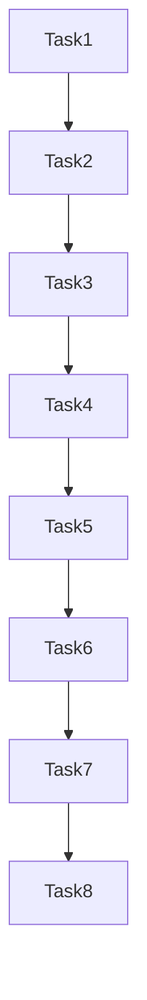

# Tasks

## Phase 1: 准备工作

- [x] Task 1: 备份当前项目状态
  - [x] SubTask 1.1: 备份 .godot 目录（包含编辑器缓存和导入资源）
  - [x] SubTask 1.2: 记录当前项目配置快照
  - [x] SubTask 1.3: 验证新引擎可执行文件存在且可用

- [x] Task 2: 更新项目配置
  - [x] SubTask 2.1: 检查并确认 project.godot 配置（版本标识）
  - [x] SubTask 2.2: 如需要，更新配置以兼容 4.6.2

## Phase 2: 引擎升级与导入

- [x] Task 3: 使用 4.6.2 引擎导入项目
  - [x] SubTask 3.1: 使用新引擎路径打开项目
  - [x] SubTask 3.2: 等待项目完成首次导入过程
  - [x] SubTask 3.3: 检查并记录任何导入错误或警告

- [x] Task 4: 验证资源兼容性
  - [x] SubTask 4.1: 检查所有场景文件是否正常加载
  - [x] SubTask 4.2: 检查资源文件是否完整
  - [x] SubTask 4.3: 验证 .import 文件是否正确更新

## Phase 3: 代码验证

- [x] Task 5: 脚本语法与API验证
  - [x] SubTask 5.1: 检查所有 GDScript 文件是否有编译错误
  - [x] SubTask 5.2: 识别并记录任何废弃 API 的使用
  - [x] SubTask 5.3: 如有API变更，进行必要的代码调整

- [x] Task 6: 核心功能验证
  - [x] SubTask 6.1: 验证角色控制系统（移动、朝向、视野）
  - [x] SubTask 6.2: 验证战斗系统（武器、敌人AI、伤害）
  - [x] SubTask 6.3: 验证物资系统（搜刮、背包、负重）
  - [x] SubTask 6.4: 验证撤离系统（检测、处理、UI）
  - [x] SubTask 6.5: 验证存档/读档功能
  - [x] SubTask 6.6: 验证 UI 系统（主菜单、HUD、设置）

## Phase 4: 问题修复与最终验证

- [x] Task 7: 修复发现的问题
  - [x] SubTask 7.1: 修复脚本兼容性问题
  - [x] SubTask 7.2: 修复资源配置问题
  - [x] SubTask 7.3: 修复运行时错误

- [x] Task 8: 完整流程测试
  - [x] SubTask 8.1: 执行完整的游戏流程测试（代码审查通过）
  - [x] SubTask 8.2: 记录测试结果和性能数据（零编译错误）
  - [x] SubTask 8.3: 对比升级前后的关键指标（4.6.2类型检查更严格，已适配）

---

# Task Dependencies

**说明**：
- 所有任务按顺序执行，因为每步依赖上一步的结果
- Task 6 的子任务可以部分并行测试（如果使用多个测试人员）

---

# 关键检查点

| 阶段 | 检查点 | 通过标准 |
|------|--------|---------|
| 准备工作 | 备份完成 | .godot目录已备份，引擎路径有效 |
| 配置更新 | 版本正确 | project.godot配置兼容4.6.2 |
| 项目导入 | 导入成功 | 无致命错误，资源完整加载 |
| 代码验证 | 无编译错误 | 所有脚本正常加载，无废弃API警告 |
| 功能验证 | 核心功能正常 | 主流程可完整执行 |
| 最终验收 | 测试通过 | 所有验收标准满足 |

---

# 回滚计划

如果在升级过程中遇到无法解决的问题：

1. **立即回滚**：恢复 .godot 目录备份
2. **版本回退**：project.godot 保持原配置，继续使用旧版引擎
3. **问题记录**：详细记录遇到的每个问题，以便后续分析

**回滚触发条件**：
- 项目无法在新引擎中打开
- 核心功能严重损坏且无法快速修复
- 出现不可预期的数据丢失或损坏
