# 鸭科夫游戏架构设计文档

## 一、架构概览

### 1. 核心模块划分

```mermaid
flowchart TD
    subgraph 核心循环模块
        CoreLoop[核心循环模块]
        BasePreparation[基地整备]
        WarzoneEntry[进入战区]
        Looting[搜索/搜刮]
        Combat[战斗]
        Evacuation[撤离]
        BaseReturn[返回基地]
        Storage[存入仓库]
    end

    subgraph 成长层模块
        GrowthLayer[成长层模块]
        PerkSystem[Perk技能树]
        BodyTraining[身体训练]
        BlueprintResearch[蓝图研究]
        EquipmentModification[装备改装]
    end

    subgraph 风险层模块
        RiskLayer[风险层模块]
        TimeSystem[时间奖励/惩罚]
        DeathMechanism[死亡机制]
        SecondaryRisk[二次风险]
        SafetySlot[安全槽]
    end

    subgraph 基地建设模块
        BaseConstruction[基地建设模块]
        Workbench[工作台]
        ResearchStation[蓝图研究站]
        MedicalStation[医疗站]
        Armory[军备室]
        Gym[健身房]
        StorageLocker[储物柜]
    end

    subgraph 战区探索模块
        WarzoneExploration[战区探索模块]
        MapStructure[地图结构]
        LootSpawn[物资刷新]
        WeatherSystem[天气系统]
        EvacPoint[撤离机制]
        ShortcutUnlock[捷径解锁]
    end

    subgraph 战斗模块
        CombatModule[战斗模块]
        TopDownView[俯视角控制]
        WeaponSystem[武器库]
        ModSystem[改装系统]
        AmmoManagement[弹药管理]
        EnemyDesign[敌人设计]
        TerrainUtilization[地形利用]
    end

    subgraph 经济模块
        EconomyModule[经济模块]
        ResourceAllocation[物资分配]
        TradingSystem[交易系统]
        CraftingSystem[制造系统]
        UpgradeSystem[升级系统]
    end

    subgraph 轻量化设计模块
        LightweightDesign[轻量化设计模块]
        TopDownControl[俯视角控制]
        SimplifiedInventory[简化背包管理]
        PVEOnly[纯PVE设计]
        DifficultyAdjustment[可调难度]
    end

    CoreLoop --> GrowthLayer
    CoreLoop --> RiskLayer
    CoreLoop --> BaseConstruction
    CoreLoop --> WarzoneExploration
    CoreLoop --> CombatModule
    CoreLoop --> EconomyModule
    CoreLoop --> LightweightDesign
    
    GrowthLayer --> BaseConstruction
    RiskLayer --> WarzoneExploration
    RiskLayer --> CombatModule
    BaseConstruction --> EconomyModule
    WarzoneExploration --> CombatModule
    CombatModule --> RiskLayer
    EconomyModule --> GrowthLayer
    EconomyModule --> BaseConstruction
```



### 2. 模块依赖关系

| 模块 | 依赖模块 | 被依赖模块 |
|------|---------|----------|
| 核心循环模块 | 所有其他模块 | 无 |
| 成长层模块 | 经济模块、基地建设模块 | 核心循环模块 |
| 风险层模块 | 战区探索模块、战斗模块 | 核心循环模块 |
| 基地建设模块 | 经济模块、成长层模块 | 核心循环模块 |
| 战区探索模块 | 风险层模块 | 核心循环模块、战斗模块 |
| 战斗模块 | 风险层模块、战区探索模块 | 核心循环模块 |
| 经济模块 | 无 | 核心循环模块、成长层模块、基地建设模块 |
| 轻量化设计模块 | 无 | 核心循环模块 |

## 二、模块接口设计

### 1. 核心循环模块接口

```typescript
// 核心循环模块接口
export interface CoreLoopInterface {
  // 基地整备
  prepareBase(): void;
  // 进入战区
  enterWarzone(mapId: string): void;
  // 搜索/搜刮物资
  loot(): LootItem[];
  // 战斗
  engageCombat(enemyId: string): CombatResult;
  // 撤离
  evacuate(evacPointId: string): boolean;
  // 返回基地
  returnToBase(): void;
  // 存入仓库
  storeItems(items: LootItem[]): void;
}
```

### 2. 成长层模块接口

```typescript
// 成长层模块接口
export interface GrowthLayerInterface {
  // Perk技能树
  unlockPerk(perkId: string): boolean;
  // 身体训练
  trainBody(statId: string): boolean;
  // 蓝图研究
  researchBlueprint(blueprintId: string): boolean;
  // 装备改装
  modifyEquipment(equipmentId: string, modificationId: string): boolean;
}
```

### 3. 风险层模块接口

```typescript
// 风险层模块接口
export interface RiskLayerInterface {
  // 时间奖励/惩罚
  getTimeBonus(timeSpent: number): Bonus;
  // 死亡机制
  handleDeath(): DeathResult;
  // 二次风险
  handleSecondaryRisk(): SecondaryRiskResult;
  // 安全槽
  getSafetySlotItems(): LootItem[];
}
```

### 4. 基地建设模块接口

```typescript
// 基地建设模块接口
export interface BaseConstructionInterface {
  // 建造设施
  buildFacility(facilityId: string): boolean;
  // 升级设施
  upgradeFacility(facilityId: string): boolean;
  // 使用设施
  useFacility(facilityId: string, action: string, params: any): any;
  // 获取设施状态
  getFacilityStatus(facilityId: string): FacilityStatus;
}
```

### 5. 战区探索模块接口

```typescript
// 战区探索模块接口
export interface WarzoneExplorationInterface {
  // 生成地图
  generateMap(mapId: string): MapData;
  // 刷新物资
  spawnLoot(mapId: string, position: Position): LootItem[];
  // 应用天气效果
  applyWeatherEffect(weatherType: string): WeatherEffect;
  // 检查撤离点
  checkEvacPoint(evacPointId: string): EvacPointStatus;
  // 解锁捷径
  unlockShortcut(shortcutId: string): boolean;
}
```

### 6. 战斗模块接口

```typescript
// 战斗模块接口
export interface CombatModuleInterface {
  // 处理攻击
  handleAttack(weaponId: string, targetId: string): AttackResult;
  // 处理防御
  handleDefense(defenseId: string, damage: number): DefenseResult;
  // 管理弹药
  manageAmmo(weaponId: string, ammoType: string, amount: number): boolean;
  // 利用地形
  useTerrain(terrainId: string, action: string): TerrainEffect;
}
```

### 7. 经济模块接口

```typescript
// 经济模块接口
export interface EconomyModuleInterface {
  // 分配物资
  allocateResources(resources: Resource[], allocation: Allocation[]): boolean;
  // 出售物品
  sellItems(items: LootItem[]): number;
  // 拆解物品
  dismantleItems(items: LootItem[]): Resource[];
  // 购买物品
  buyItem(itemId: string, amount: number): boolean;
  // 升级设施
  upgradeFacility(facilityId: string): boolean;
}
```

### 8. 轻量化设计模块接口

```typescript
// 轻量化设计模块接口
export interface LightweightDesignInterface {
  // 俯视角控制
  controlTopDownView(camera: Camera): void;
  // 简化背包管理
  manageInventory(items: LootItem[]): InventoryStatus;
  // 纯PVE设计
  ensurePVEOnly(): void;
  // 调整难度
  adjustDifficulty(level: number): boolean;
}
```

## 三、数据结构设计

### 1. 核心数据结构

```typescript
// 物品数据结构
export interface LootItem {
  id: string;
  name: string;
  type: 'weapon' | 'armor' | 'medicine' | 'resource' | 'blueprint' | 'collectible';
  rarity: 'common' | 'uncommon' | 'rare' | 'epic' | 'legendary';
  value: number;
  weight: number;
  effects?: Effect[];
}

// 角色数据结构
export interface Player {
  id: string;
  name: string;
  level: number;
  position: { x: number; y: number };
  stats: {
    health: number;
    stamina: number;
    strength: number;
    agility: number;
    intellect: number;
  };
  perks: string[];
  inventory: LootItem[];
  equipment: {
    weapon: LootItem | null;
    armor: LootItem | null;
    accessories: LootItem[];
  };
  cash: number;
  experience: number;
}

// 地图数据结构
export interface MapData {
  id: string;
  name: string;
  size: { width: number; height: number };
  zones: Zone[];
  evacuationPoints: EvacuationPoint[];
  shortcuts: Shortcut[];
  weather: Weather;
}

// 基地数据结构
export interface Base {
  id: string;
  name: string;
  facilities: Facility[];
  storage: LootItem[];
  resources: Resource[];
}
```

## 四、项目目录结构

```
duckov/
├── src/
│   ├── core/                 # 核心循环模块
│   │   ├── core-loop.test.ts  # 核心循环测试
│   │   └── index.ts           # 核心循环实现
│   ├── growth/                # 成长层模块
│   │   ├── growth-layer.test.ts  # 成长层测试
│   │   └── index.ts           # 成长层实现
│   ├── risk/                  # 风险层模块
│   │   ├── index.ts           # 风险层实现
│   │   └── risk-layer.test.ts  # 风险层测试
│   ├── base/                  # 基地建设模块
│   │   ├── base-construction.test.ts  # 基地建设测试
│   │   └── index.ts           # 基地建设实现
│   ├── warzone/               # 战区探索模块
│   │   └── index.ts           # 战区探索实现
│   ├── combat/                # 战斗模块
│   │   ├── combat-module.test.ts  # 战斗模块测试
│   │   └── index.ts           # 战斗模块实现
│   ├── economy/               # 经济模块
│   │   └── index.ts           # 经济模块实现
│   ├── lightweight/           # 轻量化设计模块
│   │   └── index.ts           # 轻量化设计实现
│   ├── shared/                # 共享资源
│   │   ├── types/             # 类型定义
│   │   │   └── index.ts       # 类型定义文件
│   │   └── utils/             # 工具函数
│   │       ├── event-system.ts  # 事件系统
│   │       └── service-locator.ts  # 服务定位器
│   └── index.ts               # 入口文件
├── docs/                      # 文档
│   ├── architecture/          # 架构文档
│   ├── modules/               # 模块说明文档
│   └── guides/                # 游戏操作指南
├── package.json               # 项目配置
├── tsconfig.json              # TypeScript配置
└── README.md                  # 项目说明
```

## 五、模块间通信机制

### 1. 事件系统

使用事件系统实现模块间的通信，避免直接依赖。

```typescript
// 事件系统示例
export class EventSystem {
  private events: Map<string, Function[]> = new Map();

  on(event: string, callback: Function): void {
    if (!this.events.has(event)) {
      this.events.set(event, []);
    }
    this.events.get(event)?.push(callback);
  }

  emit(event: string, ...args: any[]): void {
    const callbacks = this.events.get(event);
    if (callbacks) {
      callbacks.forEach(callback => callback(...args));
    }
  }

  off(event: string, callback: Function): void {
    const callbacks = this.events.get(event);
    if (callbacks) {
      const index = callbacks.indexOf(callback);
      if (index > -1) {
        callbacks.splice(index, 1);
      }
    }
  }
}
```

### 2. 服务定位器

使用服务定位器模式管理模块实例，提供统一的访问方式。

```typescript
// 服务定位器示例
export class ServiceLocator {
  private static instance: ServiceLocator;
  private services: Map<string, any> = new Map();

  static getInstance(): ServiceLocator {
    if (!ServiceLocator.instance) {
      ServiceLocator.instance = new ServiceLocator();
    }
    return ServiceLocator.instance;
  }

  registerService(name: string, service: any): void {
    this.services.set(name, service);
  }

  getService(name: string): any {
    return this.services.get(name);
  }

  removeService(name: string): void {
    this.services.delete(name);
  }
}
```

## 六、设计原则

### 1. 模块化设计
- 每个模块职责单一，功能内聚
- 模块间通过接口通信，降低耦合度
- 模块可独立测试和替换

### 2. 可扩展性
- 支持添加新地图、新武器、新敌人等内容
- 支持添加新的游戏机制和系统
- 支持修改现有功能而不影响其他模块

### 3. 性能优化
- 合理使用缓存，减少重复计算
- 优化资源加载和管理
- 考虑游戏循环的性能开销

### 4. 代码可读性
- 遵循一致的编码规范
- 提供清晰的文档和注释
- 使用有意义的变量和函数命名

## 七、总结

本架构设计基于鸭科夫游戏的核心机制和玩法设计，采用模块化的方法将游戏功能分解为多个独立的模块，通过明确的接口和依赖关系实现模块间的通信和协作。这种设计不仅提高了代码的可维护性和可扩展性，也为后续的功能扩展和性能优化提供了良好的基础。

通过事件系统和服务定位器等设计模式，我们可以实现模块间的解耦，使游戏系统更加灵活和可维护。同时，轻量化设计策略的应用，如俯视角控制、简化背包管理和纯PVE设计，将确保游戏的操作门槛和惩罚压力得到有效降低，使更多玩家能够享受游戏的乐趣。