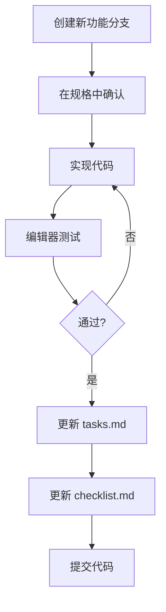

# 《逃离鸭科夫》编译运行指南

## 目录

1. [系统要求](#1-系统要求)
2. [环境搭建](#2-环境搭建)
3. [项目运行](#3-项目运行)
4. [导出游戏](#4-导出游戏)
5. [常见问题](#5-常见问题)
6. [开发工作流](#6-开发工作流)

---

## 1. 系统要求

### 1.1 开发环境要求

| 组件 | 最低要求 | 推荐配置 |
|------|---------|---------|
| 操作系统 | Windows 10 / macOS 10.14 / Ubuntu 20.04 | Windows 11 / macOS 13+ / Ubuntu 22.04+ |
| CPU | 双核 2.0 GHz | 四核 3.0 GHz+ |
| 内存 | 4 GB RAM | 8 GB RAM+ |
| 显卡 | 支持 OpenGL 3.3 | 支持 Vulkan / DirectX 12 |
| 硬盘空间 | 2 GB | 10 GB+ |
| Godot版本 | 4.3 | 4.3+ |

### 1.2 运行环境要求

**Windows PC**:
- Windows 10 或更高版本
- 支持 DirectX 12 或 Vulkan
- 4 GB RAM

**移动端**:
- Android 7.0 (API 24) 或更高版本
- iOS 14.0 或更高版本
- 2 GB RAM

---

## 2. 环境搭建

### 2.1 安装 Godot 引擎

#### Windows

1. 访问 [Godot 官网](https://godotengine.org/download/windows)
2. 下载 **Godot 4.3 - .NET 6.0** (推荐，支持C#) 或标准版本
3. 解压到任意目录，例如 `C:\Program Files\Godot`
4. （可选）将 Godot 添加到系统 PATH

#### macOS

1. 访问 [Godot 官网](https://godotengine.org/download/macos)
2. 下载 Godot 4.3 .dmg 文件
3. 挂载 DMG，拖入 Applications
4. （可选）在终端运行：
   ```bash
   sudo xattr -d com.apple.quarantine /Applications/Godot.app
   ```

#### Linux (Ubuntu/Debian)

```bash
# 方式1: 使用 Flatpak (推荐)
flatpak install flathub org.godotengine.Godot

# 方式2: 手动下载
wget https://downloads.tuxfamily.org/godotengine/4.3/Godot_v4.3-stable_linux.x86_64.zip
unzip Godot_v4.3-stable_linux.x86_64.zip
sudo mv Godot_v4.3-stable_linux.x86_64 /usr/local/bin/godot
sudo chmod +x /usr/local/bin/godot
```

### 2.2 安装导出模板

1. 打开 Godot 编辑器
2. 点击菜单 **Editor** → **Manage Export Templates**
3. 点击 **Download and Install**
4. 等待下载并安装完成（约 500MB）

### 2.3 获取项目

项目已位于 `/workspace/duckov_game/` 目录：

```bash
cd /workspace/duckov_game/
ls -la
```

项目结构确认：
```
duckov_game/
├── autoload/
├── resources/
├── scenes/
├── scripts/
├── assets/
├── project.godot
├── icon.svg
└── .gitignore
```

---

## 3. 项目运行

### 3.1 在编辑器中运行

1. 启动 Godot 4.3
2. 点击 **Import** → 浏览到 `/workspace/duckov_game/project.godot`
3. 点击 **Import & Edit**
4. 等待项目加载完成
5. 按 **F5** 键或点击右上角的 **Play** 按钮
6. 游戏将在新窗口中启动

### 3.2 命令行运行

#### Windows

```powershell
# 进入项目目录
cd C:\workspace\duckov_game

# 使用 Godot 运行项目
"C:\Program Files\Godot\Godot_v4.3-stable_win64.exe" --path .
```

#### macOS/Linux

```bash
# 进入项目目录
cd /workspace/duckov_game

# 使用 Godot 运行项目
godot --path .
```

### 3.3 运行测试场景

在编辑器中：
1. 在文件系统面板中找到需要测试的场景文件
2. 双击打开场景
3. 按 **F6** 键或点击 **Play Scene** 按钮

---

## 4. 导出游戏

### 4.1 配置导出预设

1. 打开项目后，点击菜单 **Project** → **Export**
2. 点击 **Add** 添加导出预设

#### Windows 导出

1. 选择 **Windows Desktop**
2. 配置选项：
   - **Application/Run in background**: 勾选
   - **Application/Icon**: 选择 `icon.svg`
   - **Application/File Version**: 1.0.0
   - **Display/Windowed**: 勾选
   - **Binary Format/Embed PCK**: 勾选（单文件）
3. 点击 **Export Project**
4. 选择保存位置，例如 `duckov_game.exe`

#### Linux 导出

1. 选择 **Linux/X11**
2. 配置选项：
   - **Application/Icon**: 选择 `icon.svg`
   - **Application/Version**: 1.0.0
   - **Binary Format/Embed PCK**: 勾选
3. 点击 **Export Project**

#### Android 导出

1. 选择 **Android**
2. 配置导出：
   - 需要先配置 Android SDK
   - 设置 **Unique Name** (com.yourcompany.duckov)
   - 设置 **Name** (逃离鸭科夫)
   - 设置 **Version** (1.0.0)
   - 勾选 **Internet** 权限（如需）
3. 点击 **Export Project** 生成 APK

#### iOS 导出

1. 选择 **iOS**
2. 配置：
   - 需要 Xcode 和 Apple Developer 账号
   - 设置 **Bundle Identifier**
   - 设置 **Export Method** (App Store / Ad Hoc)
3. 导出为 Xcode 项目后编译

### 4.2 命令行导出

#### Windows

```powershell
cd /workspace/duckov_game
godot --headless --export-debug "Windows Desktop" export/duckov_game_debug.exe
godot --headless --export-release "Windows Desktop" export/duckov_game.exe
```

#### Linux

```bash
cd /workspace/duckov_game
mkdir -p export
godot --headless --export-debug "Linux/X11" export/duckov_game_debug.x86_64
godot --headless --export-release "Linux/X11" export/duckov_game.x86_64
```

### 4.3 发布检查清单

导出前确认：

- [ ] 游戏在编辑器中运行无错误
- [ ] 所有资源路径正确
- [ ] 存档功能正常
- [ ] 设置已保存
- [ ] 图标和元数据已配置
- [ ] 版本号已更新
- [ ] 导出模板已安装
- [ ] 测试过发布版本

---

## 5. 常见问题

### 5.1 编辑器问题

**Q: 打开项目时出现 "Couldn't load project.godot" 错误**

A: 确保 `project.godot` 文件存在且格式正确，尝试用文本编辑器打开检查。

**Q: 场景文件损坏无法打开**

A: 检查 `.godot/backup/` 目录，找到最近的备份恢复。

**Q: 编辑器运行缓慢或卡顿**

A: 
1. 关闭不必要的插件
2. 减少场景中的 Node 数量
3. 降低编辑器渲染质量
4. 检查是否有无限循环

### 5.2 导出问题

**Q: 导出按钮灰色不可用**

A: 需要先下载并安装导出模板（Editor → Manage Export Templates）

**Q: 导出的游戏无法运行**

A: 
1. 检查是否缺少必要的 DLL/库文件
2. 尝试非嵌入式 PCK 导出
3. 检查杀毒软件是否拦截
4. 查看错误日志

**Q: Android 导出失败**

A: 
1. 确认 Android SDK 已正确配置
2. 检查是否有足够的磁盘空间
3. 尝试清理构建缓存

### 5.3 运行时问题

**Q: 游戏启动后黑屏**

A: 
1. 检查主场景设置 (Project → Project Settings → Application → Run)
2. 确认主场景存在且可加载
3. 检查是否有代码错误阻止场景加载

**Q: 存档不保存**

A: 
1. 检查用户目录写入权限
2. 确认 SaveManager 逻辑正确
3. 查看控制台是否有错误信息

**Q: 性能问题/帧率低**

A: 
1. 使用性能分析器（Debug → Show Debugger）
2. 减少同时存在的敌人/子弹数量
3. 优化场景树结构
4. 使用对象池
5. 降低渲染质量

### 5.4 开发调试

启用调试信息：

1. 点击菜单 **Debug** → **Visible Collision Shapes**（查看碰撞体）
2. 点击 **Debug** → **Visible Navigation**（查看导航）
3. 使用 `print_debug()` 和 `push_warning()` 输出调试信息
4. 按 **F8** 设置断点，**F9** 单步执行

---

## 6. 开发工作流

### 6.1 推荐开发流程



### 6.2 Git 工作流

```bash
# 1. 创建功能分支
git checkout -b feature/new-feature

# 2. 开发并测试
# ... 编写代码 ...

# 3. 查看变更
git status
git diff

# 4. 提交
git add .
git commit -m "feat: add new feature description"

# 5. 推送到远程
git push origin feature/new-feature
```

### 6.3 代码审查清单

提交前检查：

- [ ] 代码遵循 GDScript 风格规范
- [ ] 函数有适当的注释（如需）
- [ ] 没有遗留的调试代码
- [ ] 错误处理完善
- [ ] 内存泄漏检查
- [ ] 在编辑器中测试通过
- [ ] 更新相关文档

---

## 附录

### A. 有用的快捷键

| 快捷键 | 功能 |
|--------|------|
| F5 | 运行项目 |
| F6 | 运行当前场景 |
| F7 | 停止运行 |
| F8 | 切换断点 |
| F9 | 单步执行 |
| F11 | 全屏/窗口 |
| Ctrl+S | 保存场景 |
| Ctrl+Shift+S | 保存所有 |
| Ctrl+Z | 撤销 |
| Ctrl+Y | 重做 |
| Ctrl+F | 搜索 |
| Ctrl+Shift+F | 全局搜索 |
| Ctrl+D | 复制节点 |
| Delete | 删除节点 |

### B. 调试命令

```gdscript
# 打印调试信息
print_debug("Debug message")

# 打印警告
push_warning("Warning message")

# 打印错误
push_error("Error message")

# 打印到控制台（仅编辑器）
print("Hello, World!")

# 获取调用堆栈
print_stack()

# 性能计时
var start_time = Time.get_ticks_msec()
# ... 代码 ...
var elapsed = Time.get_ticks_msec() - start_time
print_debug("Took %d ms" % elapsed)
```

### C. 参考资源

- [Godot 官方文档](https://docs.godotengine.org/)
- [Godot Q&A](https://godotengine.org/qa/)
- [Godot Asset Library](https://godotengine.org/asset-library/)
- [技术文档](./TECHNICAL_DOCS.md)
- [规格文档](../.trae/specs/create-duckov-game/)

---

## 快速开始

### 最快运行方式

1. **安装 Godot 4.3**: https://godotengine.org/download
2. **打开项目**: 启动 Godot → Import → 选择 `/workspace/duckov_game/project.godot`
3. **运行游戏**: 按 **F5** 键

需要帮助？查看 [常见问题](#5-常见问题) 或参考 [技术文档](./TECHNICAL_DOCS.md)。
