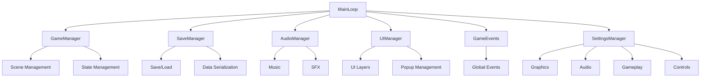
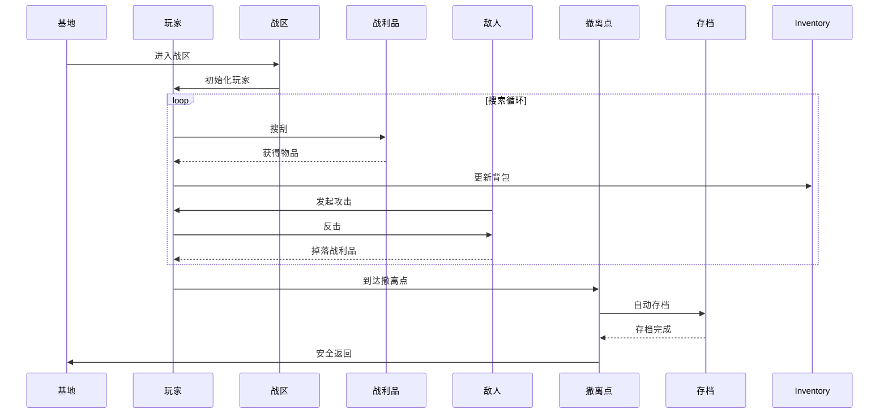
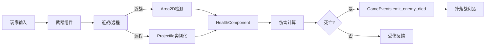
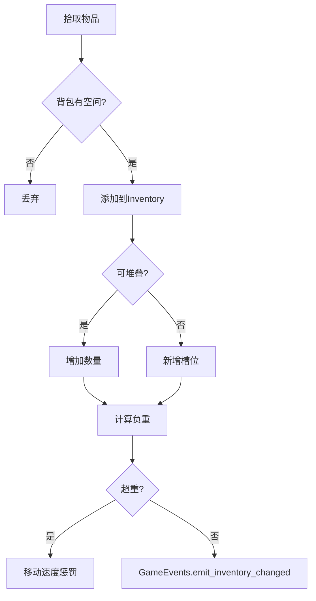
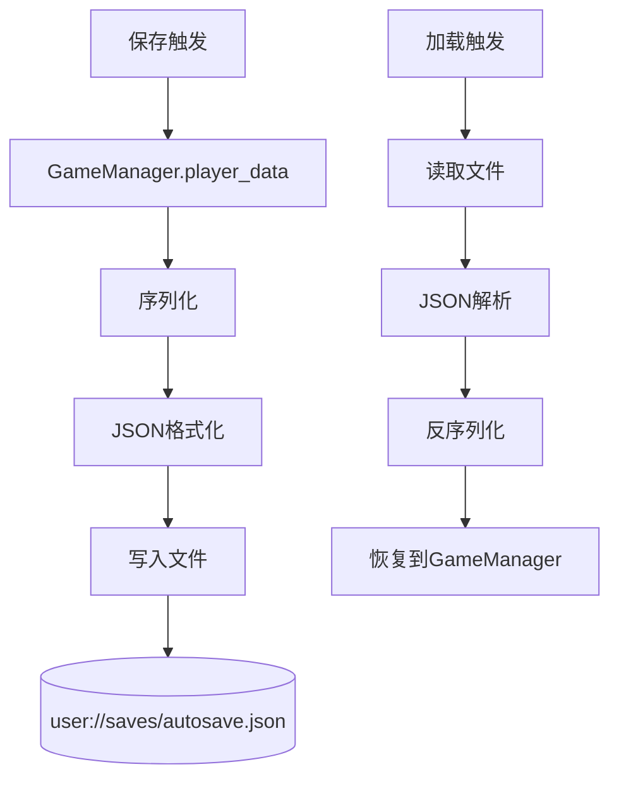

# 《逃离鸭科夫》技术文档

## 目录

1. [项目概述](#1-项目概述)
2. [技术架构](#2-技术架构)
3. [核心系统设计](#3-核心系统设计)
4. [数据流](#4-数据流)
5. [API参考](#5-api参考)
6. [资源规范](#6-资源规范)

---

## 1. 项目概述

### 1.1 项目信息

- **项目名称**: 逃离鸭科夫 (Escape from Duckov)
- **游戏类型**: 俯视角PVE搜打撤 + RPG成长 + 基地建设
- **游戏引擎**: Godot 4.3
- **开发语言**: GDScript
- **目标平台**: Windows PC, 移动端
- **美术风格**: 像素艺术
- **发布模式**: MVP优先，逐步迭代

### 1.2 核心理念

将硬核搜打撤玩法轻量化、大众化，保留"高风险高回报"的紧张感，同时大幅降低操作门槛和惩罚压力。

### 1.3 设计原则

- **模块化**: 系统间低耦合，可独立开发和测试
- **数据驱动**: 游戏数据与逻辑分离，便于平衡调整
- **易扩展**: 预留接口，便于添加新功能
- **轻量级**: 避免过度设计，保持代码简洁

---

## 2. 技术架构

### 2.1 目录结构

```
duckov_game/
├── autoload/          # 全局单例管理器
│   ├── game_manager.gd      # 游戏状态管理
│   ├── save_manager.gd      # 存档管理
│   ├── audio_manager.gd     # 音频管理
│   ├── ui_manager.gd        # UI层级管理
│   ├── game_events.gd       # 全局事件总线
│   └── settings_manager.gd  # 设置管理
├── resources/         # 数据资源定义
│   ├── item_data.gd         # 物品数据
│   ├── weapon_data.gd       # 武器数据
│   ├── enemy_data.gd        # 敌人数据
│   ├── perk_data.gd         # 技能数据
│   └── crafting_recipe.gd   # 制造配方数据
├── scenes/            # 场景文件
│   ├── main_menu.tscn       # 主菜单
│   ├── player.tscn          # 玩家角色
│   ├── enemy.tscn           # 敌人
│   ├── base.tscn            # 基地
│   ├── zones/
│   │   └── zone_1.tscn      # 战区地图
│   └── ui/
│       ├── game_hud.tscn    # 游戏HUD
│       ├── settings_ui.tscn  # 设置界面
│       └── crafting_ui.tscn  # 制造界面
├── scripts/           # GDScript脚本
│   ├── player.gd            # 玩家控制器
│   ├── enemy.gd             # 敌人AI
│   ├── weapon.gd            # 武器基类
│   ├── melee_weapon.gd      # 近战武器
│   ├── ranged_weapon.gd     # 远程武器
│   ├── projectile.gd         # 子弹
│   ├── loot_container.gd     # 搜刮容器
│   ├── loot_item.gd          # 地面物品
│   ├── extraction_point.gd   # 撤离点
│   ├── vision_cone.gd        # 视野组件
│   ├── health_component.gd   # 生命值组件
│   ├── inventory.gd          # 背包
│   ├── inventory_item.gd     # 物品
│   ├── player_data.gd        # 玩家数据
│   ├── player_stats.gd       # 玩家属性
│   ├── time_manager.gd       # 时间管理
│   ├── crafting_manager.gd   # 制造管理
│   ├── base.gd               # 基地
│   ├── zones/
│   │   └── combat_zone.gd    # 战区
│   └── ui/
│       ├── main_menu.gd       # 主菜单逻辑
│       ├── game_hud.gd        # HUD逻辑
│       ├── settings_ui.gd      # 设置逻辑
│       ├── inventory_ui.gd     # 背包UI
│       └── crafting_ui.gd      # 制造UI
├── assets/            # 美术资源
│   ├── sprites/
│   ├── audio/
│   └── fonts/
├── icon.svg
├── project.godot
└── .gitignore
```

### 2.2 全局管理器架构



### 2.3 Autoload 注册

在 [project.godot](file:///workspace/duckov_game/project.godot) 中配置：

```ini
[autoload]
GameManager="*res://autoload/game_manager.gd"
SaveManager="*res://autoload/save_manager.gd"
AudioManager="*res://autoload/audio_manager.gd"
UIManager="*res://autoload/ui_manager.gd"
GameEvents="*res://autoload/game_events.gd"
SettingsManager="*res://autoload/settings_manager.gd"
```

### 2.4 物理层定义

| 层级 | 名称 | 用途 |
|------|------|------|
| 1 | player | 玩家角色 |
| 2 | enemy | 敌人 |
| 3 | player_projectile | 玩家子弹 |
| 4 | enemy_projectile | 敌人子弹 |
| 5 | loot | 掉落物品 |
| 6 | interactable | 可交互物体 |
| 7 | obstacle | 障碍物 |
| 8 | extraction | 撤离点 |

### 2.5 输入配置

| 操作 | 按键 | 说明 |
|------|------|------|
| move_up | W, ↑ | 上移 |
| move_down | S, ↓ | 下移 |
| move_left | A, ← | 左移 |
| move_right | D, → | 右移 |
| attack | 鼠标左键 | 攻击 |
| interact | E | 交互 |
| inventory | I | 打开背包 |
| pause | ESC | 暂停 |
| reload | R | 换弹 |

---

## 3. 核心系统设计

### 3.1 游戏状态管理

**文件**: [game_manager.gd](file:///workspace/duckov_game/autoload/game_manager.gd)

状态枚举：

```gdscript
enum GameState {
	MAIN_MENU,
	PLAYING,
	PAUSED,
	DEAD,
	EXTRACTING,
	BASE
}
```

核心功能：
- 场景切换
- 游戏状态管理
- 玩家数据访问

### 3.2 事件系统

**文件**: [game_events.gd](file:///workspace/duckov_game/autoload/game_events.gd)

使用信号解耦系统间通信：

```gdscript
signal on_player_died
signal on_player_extracted
signal on_item_picked_up(item: InventoryItem)
signal on_inventory_changed
signal on_enemy_died(enemy: Node)
signal on_extraction_available(extraction_point: Node)
signal on_time_bonus_updated(multiplier: float)
signal on_boss_wave_incoming
```

### 3.3 存档系统

**文件**: [save_manager.gd](file:///workspace/duckov_game/autoload/save_manager.gd)

存档数据结构：

```json
{
  "version": "1.0.0",
  "timestamp": "2024-04-08T10:30:00",
  "player": {
    "health": 100,
    "max_health": 100,
    "money": 500,
    "experience": 100
  },
  "inventory": {
    "items": [],
    "safe_slot": null
  },
  "base": {
    "facilities": {},
    "unlocked_recipes": []
  },
  "corpses": []
}
```

### 3.4 玩家系统

**文件**: [player.gd](file:///workspace/duckov_game/scripts/player.gd)

玩家组件组成：
- CharacterBody2D: 物理移动
- Sprite2D: 视觉显示
- HealthComponent: 生命值管理
- WeaponHolder: 武器持有
- VisionCone: 视野系统
- InteractionArea: 交互检测

### 3.5 视野系统

**文件**: [vision_cone.gd](file:///workspace/duckov_game/scripts/vision_cone.gd)

扇形视野参数：
- cone_angle: 视野角度（默认90°）
- cone_radius: 视野半径（默认300px）
- 支持射线检测障碍物遮挡

### 3.6 战斗系统

**武器继承树**：
```
Weapon (基类)
├── MeleeWeapon (近战)
└── RangedWeapon (远程)
```

**文件**: 
- [weapon.gd](file:///workspace/duckov_game/scripts/weapon.gd)
- [melee_weapon.gd](file:///workspace/duckov_game/scripts/melee_weapon.gd)
- [ranged_weapon.gd](file:///workspace/duckov_game/scripts/ranged_weapon.gd)
- [projectile.gd](file:///workspace/duckov_game/scripts/projectile.gd)

### 3.7 敌人AI

**文件**: [enemy.gd](file:///workspace/duckov_game/scripts/enemy.gd)

状态机：
- idle: 待机
- patrol: 巡逻
- chase: 追击
- attack: 攻击
- return: 返回

### 3.8 背包系统

**文件**: 
- [inventory.gd](file:///workspace/duckov_game/scripts/inventory.gd)
- [inventory_item.gd](file:///workspace/duckov_game/scripts/inventory_item.gd)

核心特性：
- 一物一格简化管理
- 负重系统
- 安全槽保护（死亡不丢失）
- 堆叠机制

### 3.9 制造系统

**文件**: 
- [crafting_manager.gd](file:///workspace/duckov_game/scripts/crafting_manager.gd)
- [crafting_recipe.gd](file:///workspace/duckov_game/resources/crafting_recipe.gd)

功能：
- 配方管理
- 制造进度
- 物品拆解
- 设施等级要求

### 3.10 时间-风险系统

**文件**: [time_manager.gd](file:///workspace/duckov_game/scripts/time_manager.gd)

核心机制：
- 停留时间越长 → 稀有掉落概率越高
- 停留时间过长 → Boss成群来袭
- 最大奖励倍率: 3.0x
- Boss波触发时间: 480秒 (8分钟)

### 3.11 设置系统

**文件**: 
- [settings_manager.gd](file:///workspace/duckov_game/autoload/settings_manager.gd)
- [settings_ui.gd](file:///workspace/duckov_game/scripts/ui/settings_ui.gd)

设置分类：
- 图形（全屏、VSync）
- 音频（音乐音量、音效音量）
- 游戏（难度、自动保存）
- 控制（灵敏度、Y轴反转）

---

## 4. 数据流

### 4.1 搜打撤循环数据流



### 4.2 战斗数据流



### 4.3 背包数据流



### 4.4 存档数据流



---

## 5. API参考

### 5.1 GameManager

```gdscript
# 切换游戏状态
func change_state(new_state: GameState) -> void

# 切换场景
func change_scene(scene_path: String) -> void

# 前往主菜单
func go_to_main_menu() -> void

# 前往基地
func go_to_base() -> void

# 前往战区
func go_to_combat_zone(zone_id: String = "zone_1") -> void

# 获取玩家节点
func get_player() -> Node2D
```

### 5.2 SaveManager

```gdscript
# 保存游戏
func save_game(slot_name: String = "autosave") -> bool

# 加载游戏
func load_game(slot_name: String = "autosave") -> bool

# 检查存档是否存在
func has_save(slot_name: String = "autosave") -> bool

# 获取所有存档
func get_all_saves() -> Array[String]
```

### 5.3 AudioManager

```gdscript
# 播放背景音乐
func play_music(stream: AudioStream, fade_duration: float = 1.0) -> void

# 播放音效
func play_sfx(stream: AudioStream, volume_scale: float = 1.0) -> void

# 播放位置音效
func play_sfx_at_position(stream: AudioStream, position: Vector2, volume_scale: float = 1.0) -> void

# 设置音量
func set_music_volume(value: float) -> void
func set_sfx_volume(value: float) -> void
```

### 5.4 SettingsManager

```gdscript
# 获取设置
func get_setting(category: String, key: String) -> Variant

# 设置设置
func set_setting(category: String, key: String, value: Variant) -> void

# 难度相关
func get_difficulty() -> int
func set_difficulty(difficulty: int) -> void

# 重置默认
func reset_to_defaults() -> void
```

### 5.5 Inventory

```gdscript
# 添加物品
func add_item(item: InventoryItem) -> bool

# 移除物品
func remove_item(item: InventoryItem) -> bool
func remove_item_by_id(item_id: String, quantity: int = 1) -> bool

# 查询物品
func has_item(item_id: String, quantity: int = 1) -> bool
func find_item_by_id(item_id: String) -> InventoryItem

# 负重
func get_total_weight() -> float
func is_overburdened(max_capacity: float) -> bool

# 安全槽
func set_safe_slot_item(item: InventoryItem) -> bool
func clear_safe_slot() -> InventoryItem
```

### 5.6 CraftingManager

```gdscript
# 获取可用配方
func get_available_recipes() -> Array[CraftingRecipe]

# 开始制造
func start_crafting(recipe: CraftingRecipe, inventory: Inventory) -> bool

# 取消制造
func cancel_crafting() -> void

# 拆解物品
func dismantle_item(item: InventoryItem) -> Array

# 设置设施
func set_facility(facility: String, level: int = 1) -> void
```

### 5.7 事件系统 (GameEvents)

```gdscript
# 玩家事件
func emit_player_died() -> void
func emit_player_extracted() -> void
func emit_player_damaged(amount: float, source: Node) -> void

# 物品事件
func emit_item_picked_up(item: InventoryItem) -> void
func emit_item_dropped(item: InventoryItem) -> void
func emit_inventory_changed() -> void

# 敌人事件
func emit_enemy_died(enemy: Node) -> void
func emit_enemy_spawned(enemy: Node) -> void

# 撤离事件
func emit_extraction_available(extraction_point: Node) -> void
func emit_extraction_started() -> void

# 时间事件
func emit_time_bonus_updated(multiplier: float) -> void
func emit_boss_wave_incoming() -> void

# 成长事件
func emit_perk_unlocked(perk_id: String) -> void
func emit_recipe_unlocked(recipe_id: String) -> void
func emit_money_changed(new_amount: int, old_amount: int) -> void
```

---

## 6. 资源规范

### 6.1 资源命名

| 资源类型 | 命名规范 | 示例 |
|---------|---------|------|
| 场景文件 | 小写下划线 | `player.tscn`, `main_menu.tscn` |
| 脚本文件 | 小写下划线 | `player.gd`, `inventory.gd` |
| 资源类 | PascalCase | `ItemData`, `WeaponData` |
| 资源文件 | 小写下划线 | `item_data.gd`, `weapon_data.gd` |
| 精灵资源 | 小写下划线 | `player_idle.png`, `enemy_walk.png` |

### 6.2 代码规范

- **缩进**: 4空格
- **类名**: PascalCase
- **函数名**: snake_case
- **变量名**: snake_case
- **常量**: UPPER_SNAKE_CASE
- **信号**: on_something_happened

### 6.3 Git提交规范

遵循Conventional Commits：

```
<type>(<scope>): <subject>

类型：
- feat: 新功能
- fix: 修复bug
- docs: 文档更新
- style: 格式调整
- refactor: 重构
- test: 测试相关
- chore: 构建/工具
```

示例：
```
feat(combat): add critical hit system
fix(inventory): fix item stacking issue
docs(readme): update build instructions
```

---

## 附录

### A. 参考资料

- [Godot 4.x 官方文档](https://docs.godotengine.org/)
- [GDScript 语言指南](https://docs.godotengine.org/en/stable/tutorials/scripting/gdscript/)
- [逃离鸭科夫 核心机制文档](../鸭科夫_核心机制与玩法设计方案.md)

### B. 联系方式

- 项目目录: `/workspace/duckov_game/`
- 规格文档: `/workspace/.trae/specs/create-duckov-game/`
