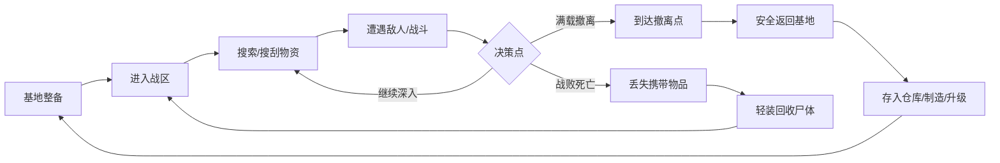
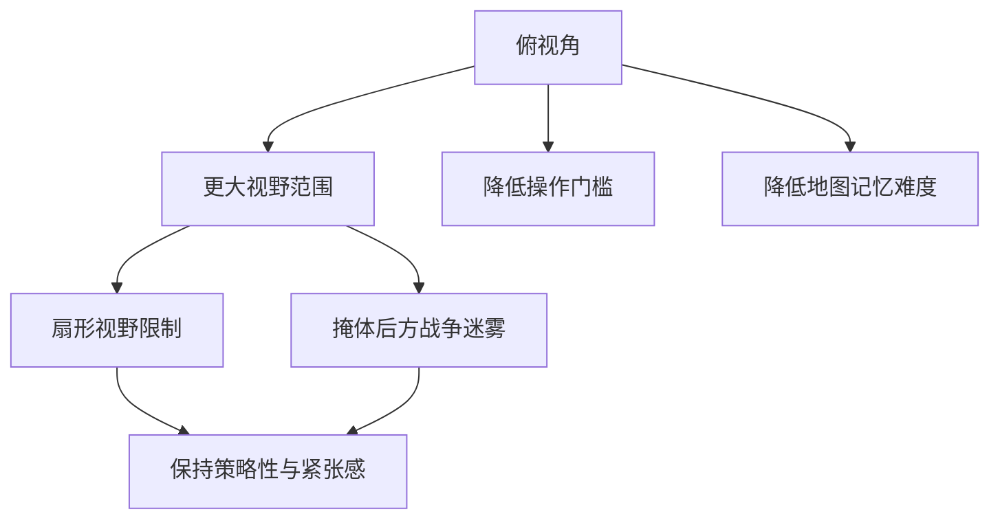
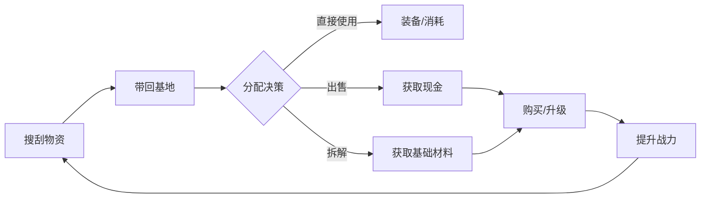
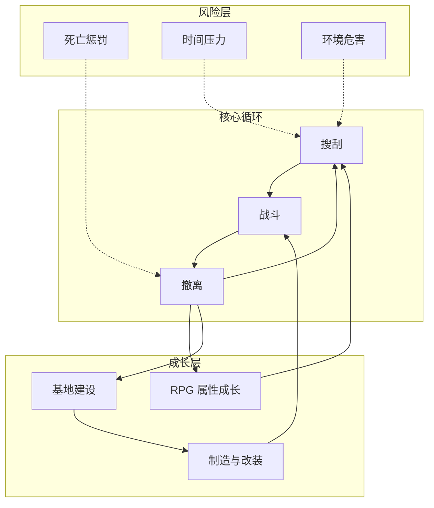
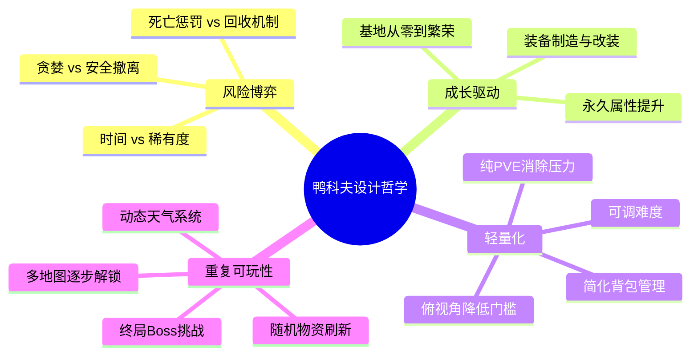

# 《逃离鸭科夫》核心机制提取与玩法设计方案

> **定位**：俯视角 PVE 搜打撤 + RPG 成长 + 基地建设
> **核心理念**：将硬核搜打撤玩法轻量化、大众化，保留"高风险高回报"的紧张感，同时大幅降低操作门槛和惩罚压力

---

## 一、核心机制提取

### 1. 搜打撤循环（核心玩法引擎）

**关键设计**：
- **搜索**：地图随机刷新物资（药品、装备、蓝图、收藏品），每次探索具有不确定性
- **战斗**：50+ 种武器，支持改装，俯视角射击降低操作门槛
- **撤离**：必须到达指定撤离点才能保住战利品，贪婪是最大的敌人

### 2. 风险-收益张力系统

| 机制 | 设计意图 |
|------|---------|
| 停留越久 → 稀有掉落概率越高 | 鼓励冒险，制造"再搜一把"的心理博弈 |
| 停留越久 → Boss 成群来袭 | 时间压力，限制无限制搜刮 |
| 死亡丢失携带物品 | 高风险惩罚，制造紧张感 |
| 尸体可回收（但有二次死亡风险） | 降低惩罚压力，避免硬核劝退 |
| 宠物槽保护贵重物品 | 提供安全网，允许玩家保底 |

### 3. 视角与信息控制

**核心取舍**：用俯视角换取低门槛，用扇形视野 + 战争迷雾补回紧张感。

### 4. RPG 成长系统

- **Perk 技能树**：消耗现金 + 核心碎片解锁永久增益（背包容量、生命值、枪法、潜行等）
- **身体训练**：健身房永久提升基础属性
- **蓝图研究**：搜刮蓝图 → 注册解锁制造配方
- **装备改装**：武器配件系统（消音器、枪口等影响射程与伤害）

### 5. 基地建设系统

| 设施 | 功能 |
|------|------|
| 工作台 | 制造与修理装备（可升级解锁高级功能） |
| 蓝图研究站 | 注册蓝图解锁配方 |
| 医疗站 | 治疗与药品制作 |
| 军备室 | 高级装备存储 |
| 健身房 | 永久提升角色属性 |
| 储物柜 | 安全存储（可扩展） |

**设计要点**：基地是"家"——绝对安全区，也是所有成长行为的枢纽。

### 6. 经济循环

### 7. 难度递进与终局设计

- **多张风格迥异的大型地图**，逐步解锁
- **环境危害系统**：如风暴区需要"风暴防护值"装备才能存活
- **Boss 挑战链**：多属性 Boss（毒/火/电/物理）→ 终局尾王
- **结局目标**：击败最终 Boss 达成胜利条件，提供明确的长远目标

---

## 二、玩法设计方案

### 设计哲学

> **"轻量外壳，硬核骨架"** —— 用可爱的主题和简化的操作包裹搜打撤的核心博弈循环。

### 系统架构总览

### 模块一：战区探索系统

**设计目标**：让每次进入战区都像"开盲盒"——充满新鲜感与不确定性。

| 设计维度 | 方案 |
|---------|------|
| 地图结构 | 多张大型地图，各有独特主题与环境机制 |
| 物资刷新 | 随机刷新点 + 隐藏资源点，保证重复游玩价值 |
| 天气系统 | 动态天气影响视野与移动，增加不确定性 |
| 撤离机制 | 固定撤离点（绿色烟雾标记）+ 特殊出口，需规划路线 |
| 捷径解锁 | 可破坏/解锁的永久捷径（如传送点），降低重复跑图疲劳 |

### 模块二：战斗系统

**设计目标**：简单易上手，但有足够的深度满足成长感。

| 设计维度 | 方案 |
|---------|------|
| 视角 | 俯视角，扇形视野 + 掩体迷雾 |
| 武器库 | 50+ 种武器，从近战到远程全覆盖 |
| 改装系统 | 配件影响射程、伤害、隐蔽性等 |
| 弹药管理 | 多种弹药类型，早期弹药伤害低（制造资源压力） |
| 敌人设计 | 近战高伤型（有预警动作）+ 远程型 + 特殊机制型 |
| 地形利用 | 沙袋等掩体提供战术优势 |

### 模块三：风险-收益博弈系统

**设计目标**：制造"再搜一把"的成瘾性心理循环。

| 设计维度 | 方案 |
|---------|------|
| 时间奖励 | 停留越久，稀有战利品概率越高 |
| 时间惩罚 | 停留越久，Boss 成群来袭 |
| 死亡机制 | 死亡丢失携带物品，但可回收尸体 |
| 二次风险 | 回收尸体时若再次死亡，永久丢失前一批物品 |
| 安全槽 | 宠物槽/锁定槽保护关键物品不计入负重且不丢失 |

### 模块四：成长与基地系统

**设计目标**：为搜打撤循环提供持续的正反馈和长期目标。

| 设计维度 | 方案 |
|---------|------|
| 永久成长 | Perk 技能树 + 身体训练，每次探索都让角色更强 |
| 基地建设 | 多种功能设施，自由布局，从零打造"家" |
| 制造系统 | 蓝图注册 → 解锁配方 → 收集材料 → 制造/升级 |
| 经济系统 | 搜刮 → 出售/拆解 → 购买/升级 → 提升战力 → 更深层探索 |
| 终局目标 | Boss 挑战链 + 最终 Boss，提供明确的通关目标 |

### 模块五：轻量化设计策略

**这是鸭科夫区别于传统搜打撤游戏的关键差异化设计：**

| 传统搜打撤 | 鸭科夫轻量化方案 | 设计意图 |
|-----------|----------------|---------|
| 第一人称视角 | 俯视角 | 降低操作门槛与3D眩晕 |
| 背包俄罗斯方块 | 一物一格，简化管理 | 减少决策疲劳 |
| 复杂弹道与后坐力 | 保留核心射击手感，简化弹道 | 保留爽感，降低学习成本 |
| 高压 PVP | 纯 PVE | 消除玩家间对抗的负面体验 |
| 永久死亡/极严惩罚 | 死亡可回收尸体 | 降低挫败感，避免劝退 |
| 硬核医疗系统 | 简化治疗物品 | 减少管理负担 |

---

## 三、核心设计原则总结

### 一句话总结

> **鸭科夫的成功公式 = 搜打撤的核心博弈循环 × RPG 成长的正反馈 × 基地建设的归属感 ÷ 传统硬核门槛**

---

## 参考来源

- [逃离鸭科夫 Wiki](https://escapefromduckov.net/zh)
- [游民星空 - 核心机制介绍](https://wap.gamersky.com/gl/Content-2035088.html)
- [旅法师营地 - 搜打撤革命](https://www.iyingdi.com/tz/post/5633457)
- [Epic - 现象级成功背后的故事](https://store.epicgames.com/zh-CN/news/escape-from-duckov-interview-jeff-chen-story-behind-success)
